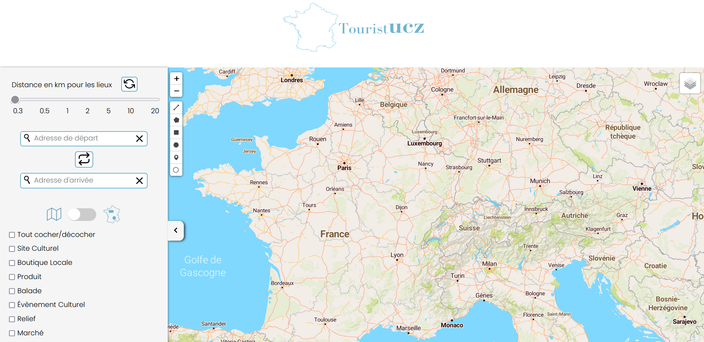
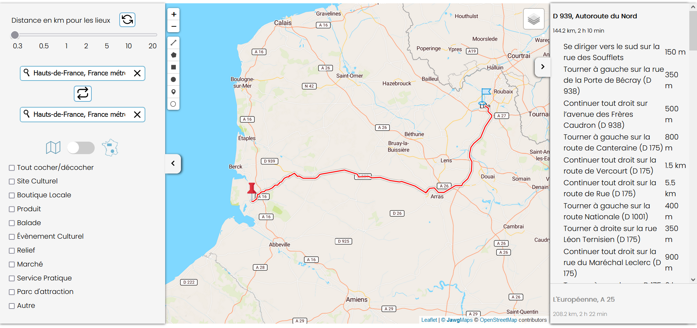
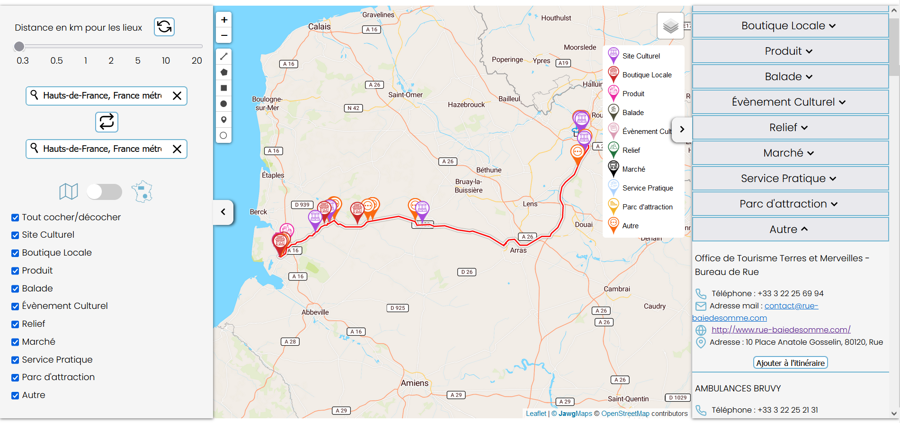
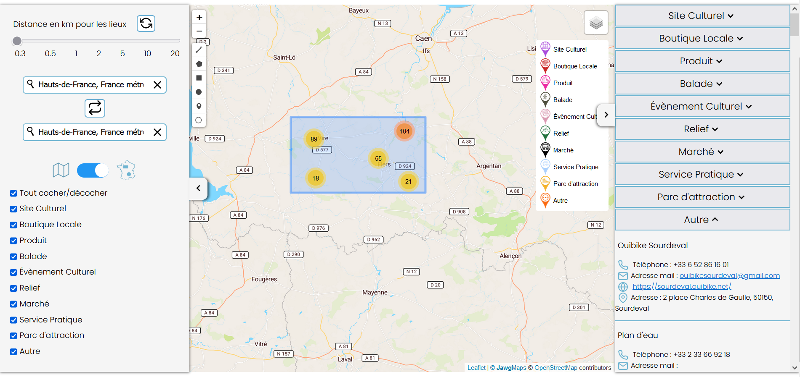

# DatatouristUCZ


## Table des matières
- [DataTouristUCZ](#datatouristucz)
  - [À propos](#à-propos)
  - [Installation](#installation)
  - [Fonctionnalités](#fonctionnalités)
  - [Galerie](#galerie)


## À propos
DataTouristUCZ est un site web intégrant les données de https://info.datatourisme.fr sur une carte interactive.

## Installation
Le site web est créé en local via la commande ```python run.py``` dans le dossier. La base de données aussi est stockée en local.  
Pour installer la BD:
- Installer MongoDB (https://www.mongodb.com/docs/manual/installation/) - Compass peut être pratique plus tard
- Si vous souhaitez utiliser toutes les données: récupérer les données sur https://info.datatourisme.fr, sous le format "Fichiers JSON"
- Mettre le dossier "objects" de l'archive dans le dossier du projet
- Assurez-vous d'avoir installé les dépendances python - ```pip install pymongo```
- Exécuter la commande ```python import_donnees.py``` (peut prendre du temps)  
- Si vous souhaitez tester avec une plus petite quantité de données fournies: extraire le zip data_sample, puis exécuter la commande ```python import_donnees_sample.py```

Pour lancer le site:
- Assurez-vous d'avoir installé les dépendances python - ```pip install flask```
- Exécuter la commande ```python run.py```
- Le site devrait être disponible à l'adresse http://127.0.0.1:5005/index.html

## Fonctionnalités
Le site dispose de deux modes: un mode itinéraire et un mode données. Dans le mode itinéraire, l'utilisateur peut choisir la proximité des lieux à l'itinéraire, entrer l'adresse de départ et l'adresse d'arrivée ainsi qu'inverser les deux adresses. Dans les  deux modes, l'utilisateur peut choisir parmi une liste de mots-clés les types de lieux qu'il souhaite afficher.
Par défaut, l'utilisateur est en mode itinéraire. S'il souhaite passer en mode données, il y a un temps de chargement au premier passage d'une durée assez longue. Dans le mode données, l'utilisateur peut dessiner une forme sur la carte et afficher tous les lieux dans cette forme.

## Galerie
- Site Web au chargement de la page:

- Quand un itinéraire est entré:

- Avec différents mot-clés sélectionnés:

- En mode données, quand un carré est dessiné:
